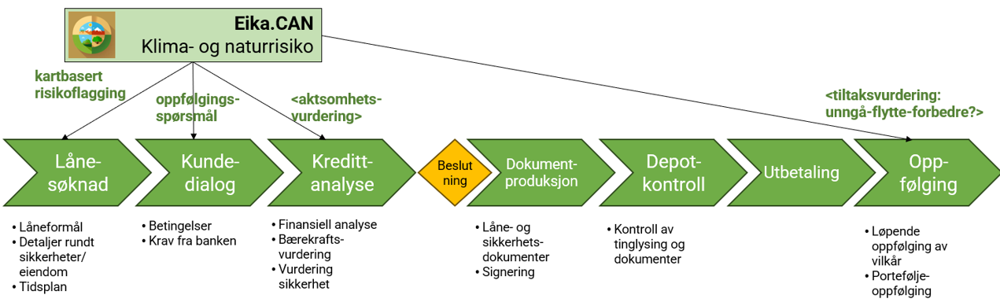

---
title: "User Guide: Eika.CAN"
author: "E.Kusch / R.Spielhofer"
date: "Last updated on `r format(Sys.time(), '%d %B, %Y')`"
output:
  html_document:
    toc: true
    toc_depth: 3
    toc_float:
      collapsed: false
      smooth_scroll: true
    number_sections: true
    theme: readable
    highlight: tango
    css: www/style.css
---

```{r setup, include=FALSE}
knitr::opts_chunk$set(echo = TRUE)
```

> **ℹ️ Overview:**  
> CAN - Climate and Nature (CAN) risk assessment user guide.

# About Eika.CAN

## What is Eika.CAN?
Eika.CAN is a web-based tool designed for comprehensive Climate and Nature (CAN) risk assessment. As the first of its kind, Eika.Can integrates research-based information from leading institutes specializing in climate and nature research. This integration ensures that users have access to the most current and reliable data for evaluating environmental risks.

## Purpose of the Tool
- **Educational Insight:** 
It familiarizes users with existing climate and nature risks, elucidating their potential impacts on the real estate sector at large.
- **Project Evaluation:**
 The tool enables the assessment of specific real estate projects across Norway, focusing on their environmental impact and susceptibility to climate-related risks.
- **Sustainable Decision-Making:**  By providing detailed analyses, Eika.Can aids individuals and organizations in evaluating their real estate aspirations and portfolios, promoting responsible and sustainable practices in the industry.

During its pilot phase, Eika.CAN focuses on:
- Methodology Development:  Creating a robust framework for integrating climate and nature risk assessments for credit assessment process.  
- Data Accessibility: ranslating complex, research-based information into user-friendly formats, making it accessible to end-users without specialized expertise.
- Application Co-Development: Collaboratively developing the web application to ensure it meets the practical needs of its intended users, incorporating feedback to refine functionality and usability.

## Collaborating Organizations
Eika.CAN is the result of a collaborative effort among three esteemed organizations:

- **[CICERO](https://www.cicero.oslo.no)**  
- **[NINA](https://www.nina.no)**  
- **[Eika Gruppen](https://www.eika.no)**

# Intended Users & Use Cases

Eika.CAN at its prototype stage is designed to support local banks to report on climate and nature risks from financing activities. In particular, the tool supports case handlers at different stages of a credit assessment process for residential market. The following workflow indicates potential applications of the tool in the credit assessment process for residential market.



# Getting Started

## System Requirements
- Modern browsers: Chrome, Firefox, Edge, Safari

## Required Input
- Gårds- and Bruksnummer
- Internal project ID (e.g. from kreditportalen)
- Project type

To retrieve gårds- and bruksnummer you can use one of these portals.
🔗 [Se eiendom](https://seeiendom.kartverket.no/)  
🔗 [NIBIO gårdskart](https://gardskart.nibio.no/search)

## Example Cases
Or you can use the following numbers to see how the evaluation works.

| Municipality | Bruksnummer | Gårdsnummer | Risk           |
|--------------|-------------|-------------|----------------|
| Lillestrøm   | 1           | 1           | Nature risk    |
| Lillestrøm   | 14          | 32          | Climate risk   |
| Lillestrøm   | 12          | 12          | No risk        |
| Verdal       | 14          | 11          | Nature risk    |
| Verdal       | 14          | 25          | Climate risk   |
| Verdal       | 12          | 33          | No risk        |
| Åfjord       | 16          | 37          | Nature risk    |
| Åfjord       | 3           | 51          | both           |
| Åfjord       | 12          | 4           | No risk        |


# Navigating the Interface

## Starting Page

- Municipality selection  

After selecting the target municipality and select **"til aktsomhetsvurdering"** the nature data page starts and a selection tab at the left side appears.


With the home button, the starting page can be recalled anywhere in the process. 
  

## Se kriterier for naturrisiko / klimarisiko
Both tabs provides an overview of the publicly available data sets that are used to calculate nature and climate risks at a later stage. These tabs might serve as capacity building and case handlers could improve their general knowledge of potential nature and climate risks in their target municipality.


## Gjør en aktsomhetsvurdering
The diligence evaluation tab allows users to conduct location-specific risk assessments for planned or existing real estate developments. Based on the mandatory input data as described previously, the evaluation generates quantitative insights into climate and nature risks for the selected plot.
The information contains of the following elements:


The map shows in red areas of the plot that intersect with one or several aspects of nature or climate risks. Dark red areas indicate more than one overlapping risk aspects. The user can observe in the selection panel at the right side of the map, which aspects are causing climate or nature risk in this area. The respective layers can be visualized by checking the boxes. In addition the background map can be changed using the two radio buttons at the top of the selection panel.

**Key Performance Indicators**  


n the example, no climate risk is detected, means that no climate relevant data intersects with the selected area. However, valuable nature intersects with the plot an thus, a red tab is appears. Since non of the climate factors intersect with the plot, a green tab indicate no climate risk for this particular project.

📌 **Note:** If a red tab appears, follow-up questions are mandatory to fill out to be able to export the evaluation.

**Details Section**  
Further down, the details for the climate and nature risk assessment can be seen by opening the tabs with (+).

Each line represents an aspect of climate or nature risk. If the line is red, it intersects with the plot and the shortest distance in meter (between plot and nature-climate risk zones) is 0. If an aspect intersects, the m2 and the relative area of intersection with regard to the whole area of the plot is indicated in the other table columns. For the nature risk, the affected land cover is provided.

**All statistics are based on the whole plot, assuming the whole plot will be modified which does not necessarily must be the case. Thus, the calculations represents a conservative estimation of risk areas.**

In case nature risks are detected, press **til oppfølgingsspørsmål** and a tab with open and closed questions will appear. Each question must be answered to be able to save the evaluation. In the tab, each questions is linked to the respective ESRS E4 reporting data point with additional information when clicking on the hyperlink.


**Reporting Tab**  
The reporting section focuses on the whole portfolio of the bank, defined as the whole collection of all screened projects. This provides a basic overview of how many projects have been screened, how many are potentially exposed to climate and/or nature risks and some distributions of projects across different risk categories. 


# Contact

For feedback or support, contact:  
📧 [reto.spielhofer@nina.no](mailto:reto.spielhofer@nina.no)  
📧 [erik.kusch@cicero.oslo.no](mailto:erik.kusch@cicero.oslo.no)
